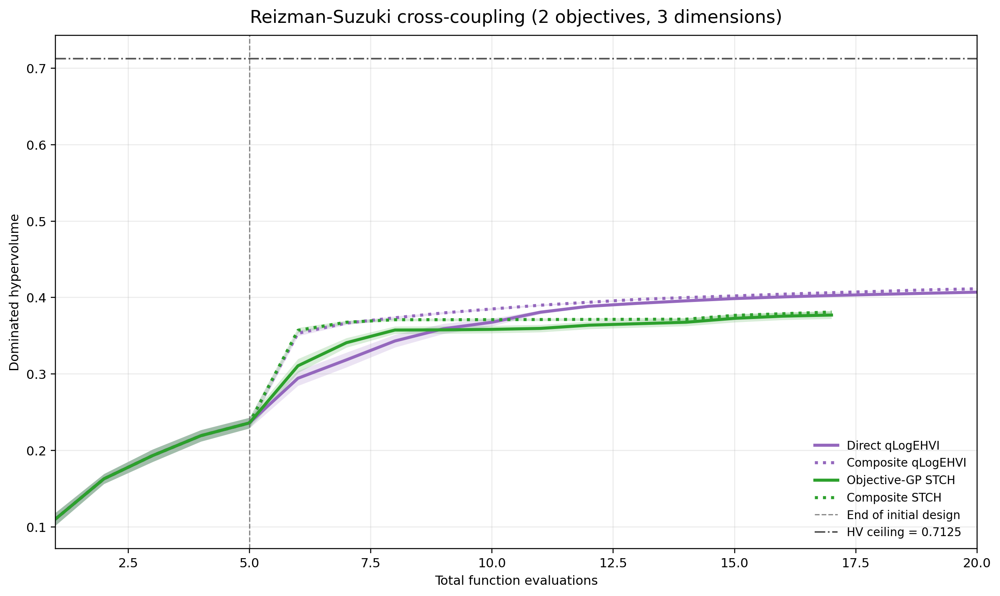
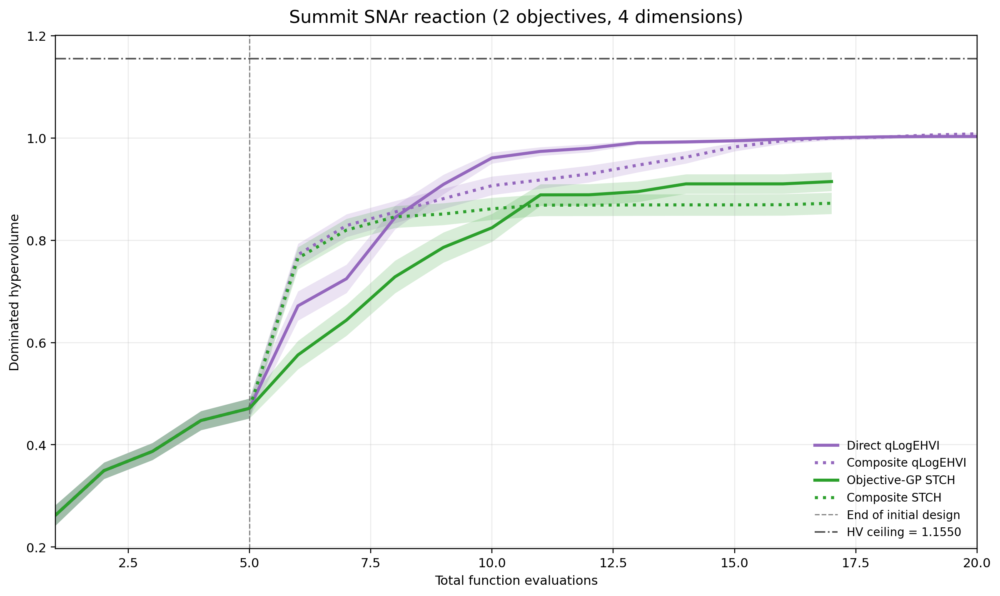

# Work summary — composite MOBO, low-dimensional benchmarks

Temporary document for collaborators. Numbers are from the 50-trial campaign at
commit `7ddf6aa`, 20 evaluations, run on the Unicorn cluster.

## 1. Why we were not seeing improvement from composition

The framework was fine. The benchmarks were asking composite modeling to do
something it cannot do.

Composite modeling replaces "fit a GP to `f`" with "fit GPs to `h`, then apply
the known `g`". That can only win if **`h` is an easier regression target than
`f`**. Our known maps were mostly averages and integrals, and those make `f`
*smoother* than `h`, so we were handing the GP the harder job and then paying
for the privilege.

### Why an averaging `g` makes `f` easier than `h`

Averaging is a low-pass filter. If `h` is a spectrum, a field, or a
concentration profile, it oscillates in the design variables; integrating it
against a weight cancels those oscillations, so `f` inherits only the smooth,
slowly-varying part. A GP with a stationary kernel needs a short length scale to
capture `h` and a long one for `f`, and short length scales are exactly what a
few hundred points cannot support.

Measured directly — same intermediate, three different maps, d=9, reporting the
fraction of a direct GP's held-out error that routing through `g` removes:

| `g` | advantage |
|---|---:|
| averaging (weighted mean of `h`) | +23% |
| exponential (Arrhenius-style) | +53% |
| sharply peaked (Shockley–Queisser shape) | +78% |

And confirmed on a real candidate: a radiative-cooling multilayer film, where
`h` is the reflectance spectrum and `g` integrates it against solar and
atmospheric weightings, scored **−8% to −13%**. Reflectance oscillates with
layer thickness through interference fringes; its integral does not.

### Why a linear `g` is strictly worse, not merely neutral

This one is provable rather than empirical. A Gaussian process is closed under
linear maps: if `h ~ GP` and `g` is linear, then `g(h)` is itself a GP. So the
composite model is not a different model class from the direct one — it is the
*same* class, reached by a constrained route, having first spent `p` separate
fits whose errors then accumulate through the sum. Modeling `p` components to
recover something a single GP could have modeled directly can only add variance.

The data agrees exactly. Penicillin's `g` selects 3 of 26 simulated states —
a selection matrix, hence linear — and scores **exactly 0.0%**. The two
optimal-power-flow benchmarks sum 29 and 45 components and score **−10.5%** and
**−4.2%**: the accumulated error of many GPs summed where two would have done.

**Practical rule:** composition needs `g` to *create* structure from a smooth
`h`, not to smooth a rough one. Ratios, exponentials, thresholds, sharp peaks.
Never means, sums, or plain integrals.

## 2. New low-dimensional benchmarks

Both are chemistry. The suggested order in the paper is Reizman–Suzuki first as
the clean demonstration, then SNAr as the substantive example.

### Reizman–Suzuki cross-coupling — the demonstration

Suzuki–Miyaura cross-coupling, catalyst fixed to P1–L2. **d=3, m=2, p=1** — one
modeled intermediate.

```
h  = Y                      reaction yield, the only measured response
f1 = 1 − Y/100              maximize yield
f2 = 1 − (Y/L)/200          maximize turnover number, L = catalyst loading
```

Turnover number is `Y/L`, and **`L` is a design variable we choose exactly**, so
it goes through the known map rather than into a second GP. One GP replaces two.
Loading spans 0.5–2.5 mol%, so `1/L` varies fivefold and turnover inherits
curvature that yield does not have, while `L ≥ 0.5` keeps the ratio off its pole.

It is about as simple as a composite benchmark can be while still being real,
which is what makes it a good opening example.

Emulator weights are vendored from Summit (MIT, 155 KiB) because Summit pins
Python <3.11; the forward pass is reimplemented. Codex verified the vendored
files are byte-identical to Summit commit `1de682d` and diffed the predictions
against a real Summit install.

*One caveat to state in the paper:* Summit predicts yield and turnover with
separate network heads that disagree by up to 42.9 turnover units. We use the
yield head and recompute turnover from the exact loading, which restores the
physical identity the source data satisfies to reported precision (ratios
0.9965–1.0009).

### SNAr — the useful example

Nucleophilic aromatic substitution of 2,4-difluoronitrobenzene with pyrrolidine
in a flow reactor, **d=4, m=2, p=5**. The four design variables are residence
time, pyrrolidine equivalents, inlet concentration, and temperature.

#### What the composition actually is

One evaluation integrates the published five-species kinetic model and returns
every outlet concentration, not just the ones the objectives need:

```
h = ( c_reagent, c_pyrrolidine, c_product, c_regioisomer, c_bis-adduct )
```

Only `c_product` is desirable. The regioisomer is the wrong substitution
position, the bis-adduct is over-reaction, and both reagents are leftovers. This
is the key point: **a chemist running this reaction measures all five by HPLC in
the same experiment.** The intermediate is free — it is what the assay already
produces — and collapsing it to two numbers before modeling throws away four
fifths of what was measured.

The known map turns those concentrations into the two things a process chemist
actually cares about:

```
space-time yield:  STY = 60 · MW_product · c_product · q / V        (kg product per m³ per hour)

environmental factor:  E = (ρ_solvent + Σ_waste MW_i · c_i) / (MW_product · c_product)
                                                              (kg waste per kg product)
```

`q = V/τ` is the volumetric flow, fixed by the reactor volume and the residence
time — both design variables — so it is computed exactly rather than modeled.
(It also cancels algebraically in E, which Ricky spotted independently.)

#### Why this structure is worth exploiting

Worth being precise here, because the obvious answer is wrong. Measuring each
objective separately:

| what is modelled | STY | E-factor |
|---|---:|---:|
| raw concentrations | **+45.8%** | +0.2% |
| raw concentrations, flow factor held constant | **+0.0%** | — |
| log concentrations (the benchmark as shipped) | +11% to +45% | **+17% to +33%** |

**STY is linear in the intermediates, and still gains 45.8%.** `STY = const ·
c_product · q(x)`. That is linear in `h`, so the GP-closure argument says it
should gain nothing — and with the flow factor held constant it gains exactly
0.0%, as predicted. But `q = V/τ` varies **fourfold** across the domain, and
that variation is worth the entire +45.8%.

The reason is that multiplying a GP by a known function `a(x)` yields a process
with kernel `a(x)a(x')k(x,x')`, which is **non-stationary**. A direct GP with a
stationary kernel cannot express that. So a map that is linear in `h` but whose
coefficients depend on `x` is *not* closed under the GP, and the composite model
is a genuinely richer class. **The closure argument only rules out linear maps
with constant coefficients** — which is exactly what the OPF and penicillin
benchmarks have, and why they score −10.5% and 0.0%.

**E-factor's ratio does less than expected.** On raw concentrations it is worth
+0.2%, essentially nothing, despite being a textbook structure-creating map. It
only becomes exploitable once concentrations are modelled on a log scale. So the
log transform is not merely numerical hygiene: `exp` is itself a
structure-creating map, and it is what makes the denominator worth modelling
separately.

Against the three conditions: `h` is smooth and low-dimensional, being ODE
solutions monotone in residence time and temperature over most of the domain, so
a GP genuinely learns it (condition 2); the flow term is known exactly and
bypasses the GP (condition 3), and here that is the dominant effect rather than
a refinement. Condition 1 holds through `exp` and the ratio together, not
through the ratio alone.

This is also why SNAr is the more *useful* of the two benchmarks despite being
messier. It is a real process-chemistry trade-off — make more product versus
generate less waste — and its exploitable structure is the ordinary shape of a
derived scientific objective: an intensive quantity scaled by a known operating
condition, and a ratio against a measured baseline. Neither is exotic, which is
the point.

#### Three fixes were needed to make it usable

1. **Deduplicated the components.** Product concentration appeared twice, so two
   GPs were fitted to bit-identical data. Beyond the wasted fit, a Monte Carlo
   draw could hand the two objectives *different* product concentrations for one
   physical state. (Caught by Ricky's review — good catch.) 6 components → 5.
2. **Moved total flow into `g`.** It is `V/τ`, a closed-form function of a design
   variable, and was being fitted by a GP.
3. **Modeled concentrations on a log scale.** The same ratio that makes this
   benchmark attractive also makes it fragile: a GP fitted to `c_product`
   directly puts posterior mass near and below zero in the low-product tail, and
   dividing by that explodes. Across five splits the screen ranged **−57% to
   +46%** — unusable as evidence. In log space `exp()` is positive by
   construction and the ratio becomes a difference.

| | before | after |
|---|---|---|
| screen | +20.2% ± 43.4%, range [−57%, +46%] | **+27.5% ± 4.3%, range [+23%, +34%]** |

A fully consumed species then needs a floor, set at 1 µM — the detection limit
of the HPLC/GC monitoring such a reaction, so below it the simulator's value is
not a measurable quantity anyway. It uses the smooth `log(c + floor)` rather
than `log(max(c, floor))`, which avoids leaving a censored plateau for the GP to
fit.

The objectives are unchanged throughout — these are changes to how the
intermediate is *represented*, not to the benchmark.

## 3. The three conditions

Full write-up with per-benchmark classification in
`docs/benchmark-search/when-composite-helps.md`.

1. **`g` must create structure, not destroy it.** Ratios, exponentials, sharp
   peaks, thresholds. Averages, sums, and integrals over a rough response fail;
   linear maps with **constant** coefficients fail provably. A map that is linear
   in `h` but scaled by a known function of `x` does *not* fail — it induces a
   non-stationary kernel a direct GP cannot express, and on SNAr that single
   effect is worth +45.8%.
2. **`h` must be learnable at the problem's dimension.** A compact intermediate
   is not automatically a learnable one. This killed the Ceviche photonics
   candidate: a perfect map (amplitude-squaring plus thresholds) over 6 numbers
   from 6084 pixels, but the component GP could not beat predicting the mean, so
   there was nothing to exploit.
3. **Anything known in closed form must bypass the GP.** The largest single
   lever. DTLZ2 was fitting a GP to `cos(πx₁/2)` where `x₁` is a design
   variable; routing it through `g` exactly — same map, same nonlinearity —
   moved d=600 from **+3% to +78%**, and inverted how advantage scales with
   dimension.

## 4. Results

50 trials, 20-evaluation budget, paired direct-vs-composite, commit `7ddf6aa`.
Hypervolume is reported as mean ± standard error; `p` is a paired Wilcoxon test.
Both arms of a pair share an initial design and Monte Carlo streams, so the
comparison is matched trial by trial.

Note the two acquisition families spend their budget differently. qLogEHVI runs
5 initial + 15 sequential evaluations. STCH branches four scalarization weights
from one shared initial design, so 20 evaluations becomes 5 + 4×3 = 17; its
trace is ordered by weight block rather than chronologically, which is why only
endpoints are reported for it.

### Reizman–Suzuki (d=3, m=2, p=1)



Solid lines are direct methods, dotted are their composite counterparts; purple
is qLogEHVI, green is STCH. Shading is one standard error over 50 trials. The
vertical dashed line is the end of the shared initial design, so everything left
of it is identical by construction.

**qLogEHVI**

| budget | direct | composite | delta | wins | p |
|---|---:|---:|---:|---:|---:|
| 7 evals | 0.31845 ± 0.00967 | 0.36656 ± 0.00232 | **+15.11%** | 39/50 | 1.7e-06 |
| 10 evals | 0.36766 ± 0.00507 | 0.38504 ± 0.00130 | **+4.73%** | 37/50 | 3.0e-06 |
| 15 evals | 0.39865 ± 0.00079 | 0.40212 ± 0.00083 | +0.87% | 36/50 | 1.4e-04 |
| 20 (final) | 0.40700 ± 0.00065 | 0.41141 ± 0.00052 | **+1.08%** | 39/50 | 6.4e-07 |

**STCH**

| budget | direct | composite | delta | wins | p |
|---|---:|---:|---:|---:|---:|
| 17 (final) | 0.37706 ± 0.00491 | 0.38104 ± 0.00159 | +1.06% | 25/50 | 0.44 |

This is the clean result. Composite wins at every qLogEHVI budget with
p ≤ 1.4e-04, and the margin is largest when data is scarcest — +15.1% at seven
evaluations, decaying to +1.1% by twenty as both methods converge on the same
front. That decay is the expected shape: surrogate quality matters most before
either method has enough data to find the front by brute force.

Composite is also markedly more *reliable* early: its standard deviation across
trials is 4.2× smaller at seven evaluations and 3.9× smaller at ten. Direct
qLogEHVI sometimes starts badly; composite essentially never does.

STCH is positive but not significant, which is unsurprising at 17 evaluations
spread across four weights — three adaptive steps per weight is very little.

### SNAr (d=4, m=2, p=5)



The crossover is visible directly: composite (dotted purple) jumps ahead the
moment the BO loop starts, direct (solid purple) overtakes around evaluation
eight, and the two converge by twenty. Note also that the STCH curves end at 17
evaluations rather than 20, for the budget reason given above.

**qLogEHVI**

| budget | direct | composite | delta | wins | p |
|---|---:|---:|---:|---:|---:|
| 7 evals | 0.72469 ± 0.02775 | 0.82865 ± 0.02232 | **+14.35%** | 36/50 | 5.6e-04 |
| 10 evals | 0.96090 ± 0.01085 | 0.90670 ± 0.01812 | **−5.64%** | 15/50 | 4.8e-03 |
| 15 evals | 0.99444 ± 0.00352 | 0.98239 ± 0.00845 | −1.21% | 21/50 | 0.33 |
| 20 (final) | 1.00287 ± 0.00297 | 1.00809 ± 0.00203 | +0.52% | 23/50 | 0.59 |

**STCH**

| budget | direct | composite | delta | wins | p |
|---|---:|---:|---:|---:|---:|
| 17 (final) | 0.91469 ± 0.01844 | 0.87230 ± 0.02087 | **−4.64%** | 17/50 | 6.3e-03 |

SNAr is not a clean win and should not be presented as one. Composite starts
well ahead (+14.4%, p=5.6e-04), then falls significantly behind at ten
evaluations (−5.6%, 15/50, p=4.8e-03), then recovers to a statistical tie.

The dip is a real effect, not sampling noise, and its shape is informative: at
ten evaluations the *median* paired difference is ≈0 while the *mean* is −0.050.
Most runs tie; a tail of runs collapses (worst three at −0.36, −0.34, −0.32). So
composite is not uniformly worse mid-run — it occasionally fails badly.

One mechanism was found and fixed: the log-space component GP could extrapolate
to `exp()` values of 3×10⁵ mol/L against a true maximum of 1.3, which a 1 µM
floor (the detection limit of the HPLC/GC monitoring such a reaction) reduces to
4×10². Whether that fully accounts for the dip is **still open** — the numbers
above already include the fix, and the dip is still present.

SNAr STCH is a genuine loss at this budget, and the only significant negative in
the set.

### Reading the two together

Both benchmarks agree on the early-budget claim: **+15.1%** and **+14.4%** at
seven evaluations, both significant. They disagree afterwards — Reizman holds its
lead to the end, SNAr does not. The honest summary is that composite modeling
buys sample efficiency in the data-scarce regime, and that on a harder,
higher-`p` problem that advantage is not stable across the whole run.

## 5. Honest caveats

- The surrogate screen predicts *modeling* accuracy, not optimization outcome.
  SNAr screens at +27.5% and shows no reliable endpoint gain.
- Both benchmarks converge fast, so a generous budget hides the effect. This is
  why the headline is measured at 20 evaluations rather than 50.
- We still have **no high-dimensional scientific benchmark** satisfying all three
  conditions. Every candidate failed on condition 1 or 2. That is a defensible
  finding in itself, but it means the high-dimensional claim is currently
  untested rather than supported.
